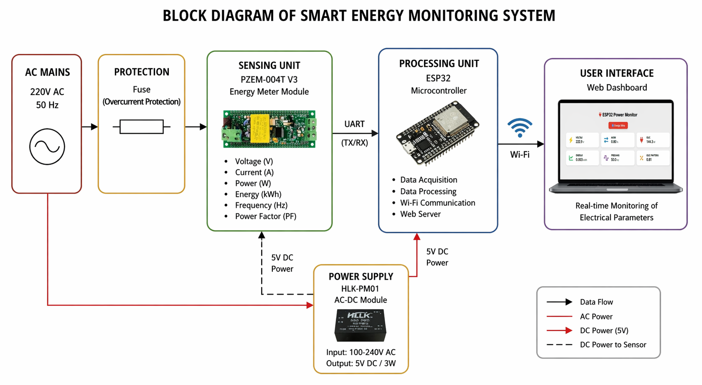
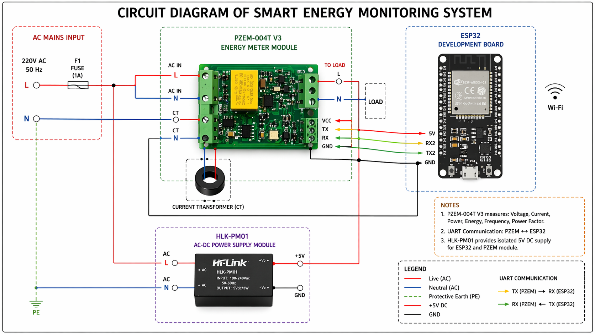

# Smart Energy Monitoring System

An IoT-based smart energy monitoring system developed for real-time electrical energy measurement, monitoring, and appliance classification.

## Overview

This project combines electrical energy measurement, embedded systems, and machine learning in a single monitoring platform.

The system collects electrical parameters from connected loads using an ESP32 and PZEM-004T V3 energy monitoring module. The measured data is transmitted through Wi-Fi and displayed through a web-based interface.

A machine learning model is used to classify connected electrical appliances based on their measured electrical characteristics.

## Features

- Real-time voltage measurement
- Current measurement
- Active power measurement
- Energy consumption monitoring
- Frequency measurement
- Power factor measurement
- Wi-Fi-based data communication
- Web-based monitoring interface
- Appliance classification using machine learning

## Hardware

- ESP32
- PZEM-004T V3
- HLK-PM01
- Fuse

## Software

- ESP32 Programming (C/C++)
- Python
- Machine Learning
- Random Forest
- Flask

## System Architecture



## Circuit Diagram



## Hardware


## Web Interface


## Measured Parameters

| Parameter    | Unit |
|--------------|------|
| Voltage      | V    |
| Current      | A    |
| Active Power | W    |
| Energy       | kWh  |
| Frequency    | Hz   |
| Power Factor | -    |

## Experimental Results

The system was tested with different electrical loads to evaluate its electrical measurement and appliance classification capabilities.

| Device | Voltage (V) | Current (A) | Power (W) | Power Factor | Frequency (Hz) |
|---|---:|---:|---:|---:|---:|
| Baseline Load | 226.50 | 0.927 | 202.41 | 0.906 | 50.0 |
| Hair Dryer (Level 1) | 222.75 | 1.584 | 319.66 | 0.964 | 50.0 |
| Hair Dryer (Level 2) | 221.62 | 2.391 | 527.24 | 0.995 | 50.0 |
| Air Fryer | 226.51 | 4.782 | 1061.50 | 0.980 | 50.0 |
| Washing Machine | 228.63 | 3.639 | 600.69 | 0.722 | 50.0 |
| Kettle | 223.74 | 7.293 | 1631.74 | 1.000 | 50.0 |

## Appliance Classification

The measured electrical data is processed by a machine learning model to classify connected electrical appliances.

The model uses electrical features such as:

- Voltage
- Current
- Active Power
- Power Factor

## Project Structure

```text
smart-energy-monitoring-system/
│
├── firmware/
│   └── esp32/
│       ├── power_monitor.ino
│       └── web.py
│
├── machine-learning/
│   ├── model_egit_window.py
│   ├── tahmin.py
│   └── veri_topla.py
│
├── data/
│   └── veri2.csv
│
├── images/
│   ├── block-diagram.png
│   ├── circuit-diagram.png
│   ├── hardware.jpg
│   ├── product.jpg
│   ├── product-working.jpg
│   ├── esp32-power-monitor.png
│   ├── web-dashboard.png
│   └── verification.png
│
├── docs/
│   └── smart-energy-monitoring-system-report.pdf
│
└── README.md
